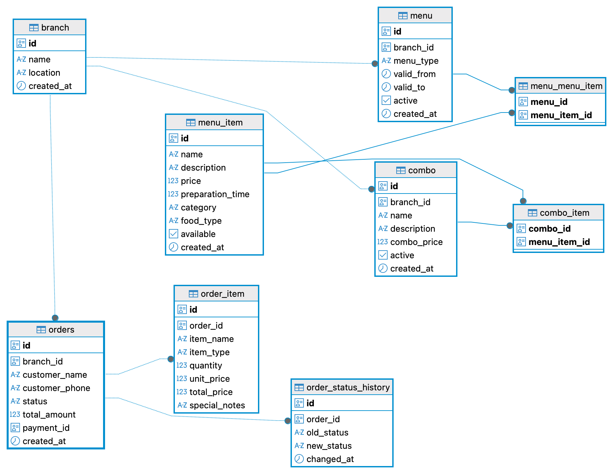
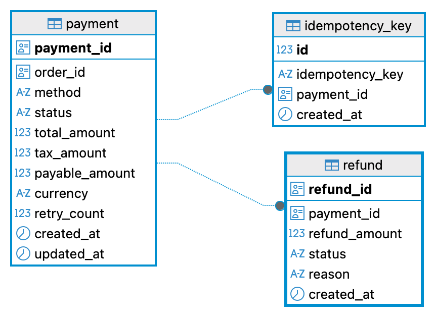

### Architecture Doc

# Restaurant Service Architecture

---

## What it does
- Manages restaurant branches
- Manages menus, menu items, and combos
- Exposes customer-facing menu APIs
- Creates and manages orders
- Calculates prices, taxes, and totals
- Controls order state transitions
- Integrates with Payment Service

---

## What it doesn’t do
- Process payments internally
- Decide payment success or failure
- Handle payment gateways

All pricing is calculated in this service.  
Payment Service is treated as an external dependency.

---

## Menu & Catalog
- Branch → Menu (Breakfast / Lunch / Dinner)
- Menu → Menu Items
- Combos built from menu items
- Time-based active menus
- Read-only customer menu APIs

---

## Order Management
- Orders store **price snapshots**
- Order items store unit price and quantity
- Supports price preview before order creation
- Prices never change after order creation

---

## Order State Machine
**States:**
- CREATED → ACCEPTED → PREPARING → READY → DELIVERED
- CANCELLED (terminal)

Rules:
- Only valid transitions allowed
- CANCELLED and DELIVERED are final
- All transitions are recorded for audit

---

## Payment Integration
- Payment initiated only after order is ACCEPTED
- Final amounts sent to Payment Service
- Payment ID stored in order
- Supports retries and refunds

Restaurant Service never trusts payment callbacks for amounts.

---

## APIs (High Level)
- Admin: branch, menu, item, combo management
- Customer: active menu, menu items, combos
- Orders: create, preview, fetch
- Order State: accept, prepare, ready, deliver, cancel
- Payments: initiate, retry, callback, refund

---

## Design Principles
- Clear service boundaries
- Immutable financial data
- Simple state machine
- Business logic in services, not controllers

---

## Database
- Orders store final payable amount
- Order items store price snapshots
- Order status history for auditing
- No payment tables in this service

---

## Why this design
- Matches real restaurant workflows
- Safe for retries and refunds
- Easy to reason about and test
- Clean separation of concerns

---

## Future Improvements
- Auto-cancel unpaid orders
- Payment reconciliation jobs
- Promotions and coupons
- Event-driven integrations

# Payment Service Architectue

**What it does:**
- Creates payment records
- Processes payments (success/fail)
- Handles refunds
- Manages payment state

**What it doesn't do:**
- Calculate prices or discounts
- Manage order items

The order service sends the final price, and we trust it.

---

**Flow:**
1. Order service creates payment (status: INITIATED)
2. Payment processes separately
3. Ends as SUCCESS or FAILED
4. Refunds only work on successful payments

Payment creation and processing are separate steps.

---

**States:**
- INITIATED → PROCESSING → SUCCESS/FAILED
- RETRYING (for timeouts)
- FAILED_PERMANENT (retry limit hit)
- REFUNDED (full refund)

Refunds are stored separately, don't modify original payment.

---

**APIs:**
- `POST /api/payments` - create payment (needs Idempotency-Key header)
- `POST /api/payments/{id}/process` - process it
- `GET /api/payments/{id}` - get details
- `POST /api/payments/{id}/refund` - refund (partial or full)

---

**Idempotency:**
Using `Idempotency-Key` header prevents duplicate charges from retries. Same key = same payment returned, not a new one.

---

**Services:**
- PaymentService - create, process, get payments
- RefundService - handles refunds and validation

Business logic stays in services, not controllers.

---

**Payment Processing:**
Mock processor now (random success/fail/timeout). Easy to swap for real gateway later.

---

**Database:**
Two tables: `payments` and `refunds`. No payment_items table - items belong to order service. Keeps it simple.

---

**Kafka:**
Optional. Only for publishing events (PaymentSucceeded, PaymentFailed, etc). Not used for core operations.

---

**Why this design:**
Simple, testable, matches real payment systems. Focused on payments only.

---

**Future:**
- Real gateway integration
- Async processing
- Scheduled retries
- Better monitoring

## Schema Architecture

### Restaurant Service Schema

Shows:
- branches, menus, menu_items, combos
- orders, order_items (price snapshots)
- order_status_history
- No payment tables (strict separation)

---

### Payment Service Schema

Shows:
- payments
- refunds
- payment → refunds relationship
- No order/menu tables

---

### Design Intent
Both services maintain **independent databases**.

- Restaurant Service → catalog + orders
- Payment Service → payments only
- Communication via APIs
- No shared schema or cross-service joins